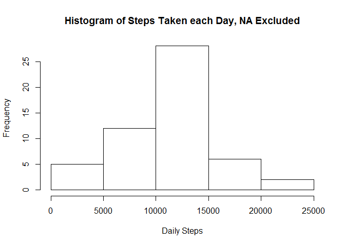
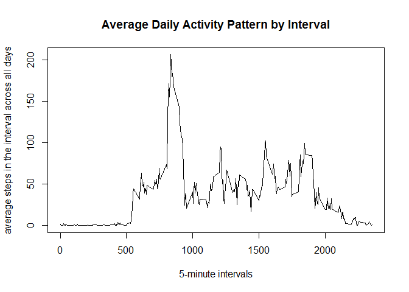
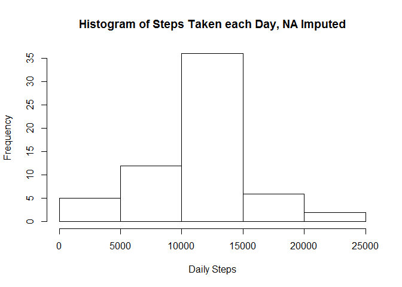

# Reproducible Research: Peer Assessment 1


## Loading and preprocessing the data

### activity.csv must be in your current working directory
### this reads the csv file in as a data frame which we can use for analysis as "rawdata" where the columns are integer, date, and integer formats.

```r
rawdata<-read.csv("activity.csv",head=TRUE,colClasses=c("integer","Date","integer"))
```
### sets "data" to only have values with no NA for the step value.

```r
data<-rawdata[!is.na(rawdata$steps),]
```
### What is mean total number of steps taken per day?

### calculating the sum steps taken per day using tapply, stored in "dailysum"

```r
dailysum<-tapply(data$steps,data$date,sum,na.rm=TRUE,simplify=T)
```
### calculating and reporting the mean and median using their respective functions and the cat function to print

```r
meanbyday<-mean(dailysum)
cat("Mean by Day=",meanbyday)
```

```
## Mean by Day= 10766.19
```

```r
medianbyday<-median(dailysum)
cat("Median by Day=",medianbyday)
```

```
## Median by Day= 10765
```
### The mean is 10766 and the median is 10765
### Histogram of daily steps


```r
hist(dailysum,xlab="Daily Steps",ylab="Frequency",main="Histogram of Steps Taken each Day, NA Excluded")
```

 

### What is the average daily activity pattern?

### calculating average for each time using tapply

```r
time_avg<-tapply(data$steps,data$interval,mean,na.rm=TRUE,simplify=T)
```
### creating the daily frequency information in a data frame

```r
dailyfrequency<-data.frame(interval=as.integer(names(time_avg)),
average=time_avg)
```
### plotting the information.

```r
plot(dailyfrequency$interval,
           dailyfrequency$average,
           type="l",
           xlab="5-minute intervals",
           ylab="average steps in the interval across all days",main="Average Daily Activity Pattern by Interval")
```

 
### calculating time interval with maximum number of steps using the max function

```r
maxinterval<-max(dailyfrequency$average)
dailyfrequency[dailyfrequency$average==maxinterval,]
```

```
##     interval  average
## 835      835 206.1698
```
### the interval 835 has the max steps with 206

## Imputing missing values

### Calculating the number of NAs using the raw data

```r
sum(is.na(rawdata))
```

```
## [1] 2304
```
### the sum is 2304
### Imputed values will be completed using the average for that 5 minute interval, first we set the imputed data to be equal to the data from the file

```r
imputed<-rawdata
```
### Then create something to track which values are NA

```r
nas<-is.na(imputed$steps)
```
### we use the time average already calculated for the previous section to fill in the missing values, using the nas logical values

```r
imputed$steps[nas]<-time_avg[as.character(imputed$interval[nas])]
```
### sum to ensure we've removed all NAs

```r
sum(is.na(imputed))
```

```
## [1] 0
```
### 0 NAs should be reported
### calculating the mean and median as before, using imputed values

```r
imputeddailysum<-tapply(imputed$steps,imputed$date,sum,na.rm=TRUE,simplify=T)
imputedmeanbyday<-mean(imputeddailysum)
cat("Imputed Mean by Day=",imputedmeanbyday)
```

```
## Imputed Mean by Day= 10766.19
```

```r
imputedmedianbyday<-median(imputeddailysum)
cat("Imputed Median by Day=",imputedmedianbyday)
```

```
## Imputed Median by Day= 10766.19
```
### the imputed mean is 10766 and the imputed median is 10766, the imputed median has gone from 10765. 
### creating a historgram from imputed data

```r
hist(imputeddailysum,xlab="Daily Steps",ylab="Frequency",main="Histogram of Steps Taken each Day, NA Imputed")
```

 
### there are slight differences in the data, since missing values were replaced by mean values there is a shift towards the mean.

## Are there differences in activity patterns between weekdays and weekends?

### we need to determine whether or not a day is a weekday or weekend. We can set non weekdays to be Weekends The function below determines whether or not a day is a weekday or weekend and labels it accordingly

```r
isweekday <- function(d) {
    weekday <- weekdays(d)
    ifelse (weekday == "Saturday" | weekday == "Sunday", "weekend", "weekday")
}
```
### creates a character vector of which days are weekdays or weekends

```r
weekdaylist<-sapply(imputed$date,isweekday)
```
### creates an additional column headed "weekday" in the imputed values labeling something a weekday or weekend

```r
imputed$weekday<- as.factor(weekdaylist)
```
### creates aggregate data for the lattice plot using steps, the interval and weekday information

```r
weekdayaggregate<-aggregate(steps~weekday+interval,data=imputed,FUN=mean)
```
### In order to create a plot using lattice we must first pull it from the library

```r
library(lattice)
```
### this creates a panel plot using the time series with 5 minute intervals on the x axis and average number of steps on the y axis with each plot headed by either weekend or weekday respectively

```r
xyplot(steps ~ interval | factor(weekday),
       layout = c(1, 2),
       xlab="Interval",
       ylab="Number of steps",
       type="l",
       lty=1,
       data=weekdayaggregate)
```

 
